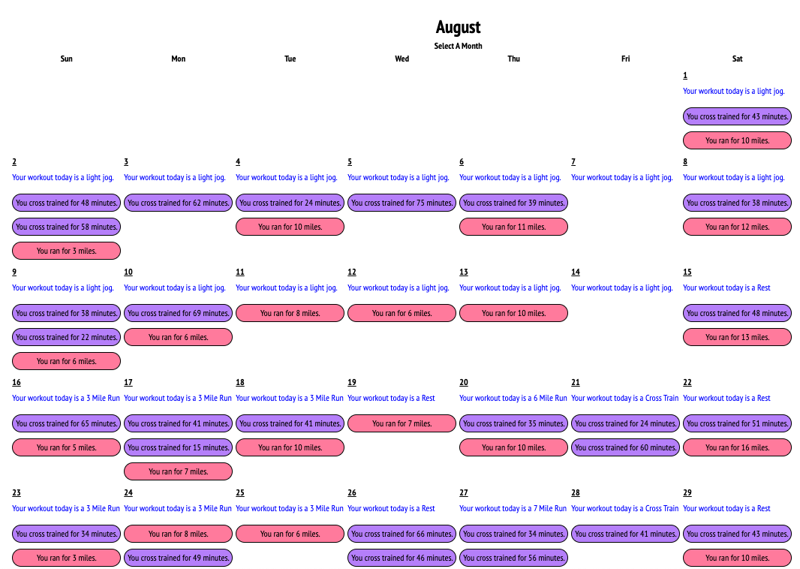

# reasonably-fast

## Description ##
This is a full-stack website that uses Moment.js and the Strava API to help users create training plans and track their progress.

### Technologies ###
  * HTML5
  * CSS
  * Javascript
  * React
  * Node
  * Express
  
 The Front Page (Home): This is the landing page for users.
  * All values are rendered dynamically.
  * Calendar is created using moment.js.
  * Strava linked to user account to pull accurate distance information.
  * Training plan from Hal Higdon's Novice 1.
  
 
 
